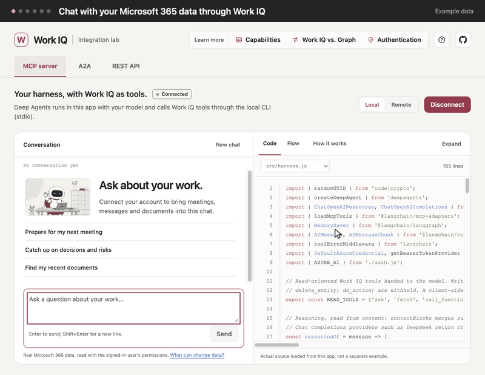

# Work IQ integration lab

A desktop app that shows three ways to build Work IQ into your own tools: MCP, A2A and the REST API. Each tab is a
live chat over your Microsoft 365 data, next to the code behind it and a trace of each call. With MCP, your own model
calls Work IQ's tools; with A2A and REST, Work IQ answers. The illustrations are AI-generated (MAI-Image-2.6).

The [documentation](https://jeffrey-groneberg.github.io/workiq-learning/) covers each route in depth: its request path, sign-in, costs
and code.

## What you need

- A Microsoft 365 tenant with [Work IQ enabled](https://learn.microsoft.com/en-us/microsoft-365/copilot/extensibility/work-iq/enable-work-iq),
  where you're assigned to its [usage-based billing plan](https://learn.microsoft.com/en-us/microsoft-365/copilot/usage-based-billing-overview-copilot-credits).
- **MCP:** a model with tool calling on Azure OpenAI, Microsoft Foundry, OpenAI or another OpenAI-compatible endpoint,
  with an API key or, on Azure, a Microsoft Entra ID sign-in such as `az login`. Local MCP runs the
  [Work IQ CLI](https://learn.microsoft.com/en-us/microsoft-365/copilot/extensibility/work-iq/cli) on your computer;
  remote MCP connects to Microsoft's hosted endpoint. Neither needs an app registration of your own.
- **A2A and REST API:** your own public-client
  [app registration](https://learn.microsoft.com/en-us/microsoft-365/copilot/extensibility/work-iq/a2a/quickstart#register-the-application-in-microsoft-entra)
  with the delegated `WorkIQAgent.Ask` permission and
  [admin consent](https://learn.microsoft.com/en-us/entra/identity/enterprise-apps/grant-admin-consent).

The app's How to, which opens on the first start, lists what each route needs, including admin consent.

## Download

[Releases](https://github.com/jeffrey-groneberg/workiq-learning/releases) has the app for Windows, macOS and Linux,
each for x64 and arm64. It runs without Node.js. The builds aren't signed, so the first start takes one extra step:

- **Windows:** extract the `.zip` and run `Work IQ Showcase.exe`. When SmartScreen stops it, choose **More info**,
  then **Run anyway**.
- **macOS** (`macos-arm64` for Apple silicon, `macos-x64` for Intel): unzip and open `Work IQ Showcase.app`. When
  macOS blocks it, choose **Open Anyway** under **System Settings > Privacy & Security**.
- **Linux:** extract the `.tar.gz` and run `./work-iq-showcase`. If it doesn't start, as on Ubuntu 24.04, run
  `sudo chown root:root chrome-sandbox && sudo chmod 4755 chrome-sandbox` in its folder first.

The Work IQ CLI's license doesn't allow shipping it in the downloads, so for local MCP, install it once with
`npm install -g @microsoft/workiq`, which needs Node.js.

## Run from source

With Node.js 22.12 or later, run `npm ci && npm start`, or `./startup.sh` on macOS and Linux. From source, the Work IQ
CLI comes with the dependencies. To pre-fill the Connect dialogs, copy `.env.example` to `.env`. Pushing a version tag
such as `v0.2.0` that matches `package.json` publishes a release; see `.github/workflows/release.yml`.
