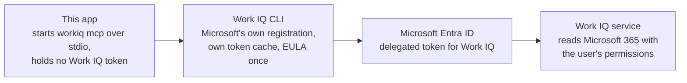
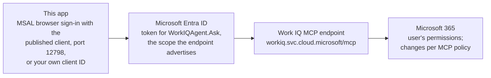
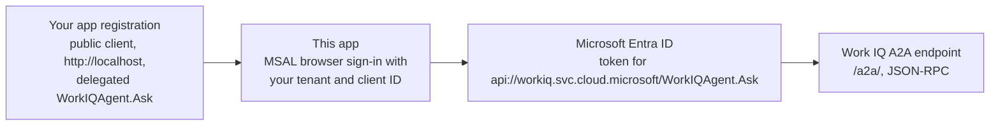
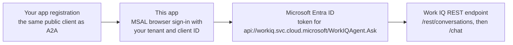
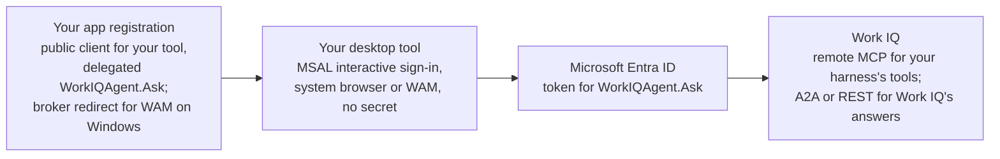

# Work IQ integration lab

A small, **live-only** desktop app for walking a customer through Work IQ
integration and the code behind it. Electron, plain JavaScript, no frontend
framework, no database. The MCP tab runs a [Deep Agents](https://docs.langchain.com/oss/javascript/deepagents/overview)
harness with a configurable Azure OpenAI model; A2A and REST need no harness.

Three tabs share a chat and an inspector:

| Tab | Actual integration | Who reasons |
| --- | --- | --- |
| **MCP server / Local** | Deep Agents + your model; Work IQ tools from the bundled official CLI over stdio | **Your harness** picks tools and writes the answer; Work IQ's `ask` tool also reasons |
| **MCP server / Remote** | Same harness; tools from `https://workiq.svc.cloud.microsoft/mcp` over Streamable HTTP | Same; local/remote tool parity is not assumed |
| **A2A** | Agent Card discovery, JSON-RPC `SendMessage`, `A2A-Version: 1.0`, `GetTask` for active tasks | **Work IQ agent**; `contextId`/`taskId` carry the conversation |
| **REST API** | `POST /rest/conversations`, then `POST /rest/conversations/{id}/chat` | **Work IQ conversation**; the service keeps the conversation ID |

**Code** displays the implementation files loaded from this app, with syntax
highlighting ([highlight.js](https://highlightjs.org/)). **Flow** draws each turn as a timeline of
who talks to whom (you, the model, Work IQ) with per-step latency, tokens and
reasoning; every step expands to its raw, highlighted JSON payload. While a
request runs, the chat shows a spinner with the current step. Each answer ends
with its total time, Work IQ and model latency, Azure OpenAI tokens and a
Copilot Credits estimate, not a bill (see [What each call costs](#what-each-call-costs)). **How it
works** explains the protocol, authentication and orchestration boundary. No
fixture answers or offline fallback ship in the app.

Each answer also shows **which Microsoft 365 entities were involved**, as icons:

- **Read** is exact: entity type and count of what the data tools (`fetch`,
  `call_function`) returned, from the request path and `@odata.context`, for
  example "10 meetings".
- **Cited** is what Work IQ's own answers (`ask`, REST attributions, A2A)
  link to or tag, such as Teams meeting links, SharePoint files, people links
  and `<Event>`/`<Person>` tags. It is inferred from those links, and it shows
  what was cited, not everything Work IQ considered internally.

Click an icon to list its items: for **Read**, the real details (for meetings:
subject, local time, organizer, location), each with a link that opens it in
Outlook, Teams or SharePoint; for **Cited**, the best available title and the
source link. **Show in payload** opens the full Work IQ response next to the
tool call that produced it, with the item's exact location (for example
`result.structuredContent.data.value[2]`) highlighted and scrolled into view:
the item's JSON for **Read**, the citing characters of the answer for **Cited**.

**Connect** opens a dialog that shows what happens in the background, step by
step as it happens: starting the CLI or reaching the hosted endpoint, the sign-in
used, the MCP handshake (`initialize`), tool discovery (`tools/list`) and which
tools the harness hands to the model; for A2A, the agent card; for REST, the new
conversation. The same steps stay in **Flow** until the first message.

## Run

Install Node.js **22.12+**, then:

```sh
npm ci
npm start
```

On macOS or Linux, `./startup.sh` does both from any directory: it installs the
dependencies on the first run, then starts the app.

The first launch may download the pinned Electron runtime. The Work IQ CLI is
bundled as a dependency, so a global `workiq` installation is not required.

For a distributable desktop folder on the current operating system:

```sh
npm run package
```

The result is in `dist/`. Build on Windows, macOS or Linux for that OS. The build
retains readable source, includes only the matching native CLI binary, excludes
`.env*` files and does not archive the native CLI inside an ASAR.
Signing, notarization, installers and automatic updates are intentionally out
of scope for this learning app. Electron supports these desktop platforms;
do not mistake that for a claim that every target has been exercised on hardware.

## Authentication: what can actually be reused?

**An Azure CLI login is not a general Work IQ credential.** Tokens belong to a
client, resource, user and tenant. A GPT deployment also does not grant access
to Microsoft 365 work data.

| Connection | Client registration | Sign-in behavior |
| --- | --- | --- |
| Local MCP | Microsoft's official CLI registration | The CLI owns sign-in and its token cache. An already authorized CLI session can be reused without exporting its token. |
| Remote MCP, IDs empty | Public client `ba081686-5d24-4bc6-a0d6-d034ecffed87` and callback port `12798`, published in Microsoft's [MCP plugin configuration](https://github.com/microsoft/work-iq/blob/main/plugins/workiq/.mcp.json) | Separate browser sign-in in this app; not a copy of Copilot's cached token. Tenant consent and conditional-access requirements still apply. |
| Remote MCP, custom IDs set | Your approved public-client registration | Uses the configured tenant and client ID. |
| A2A / REST | Your approved public-client registration | Separate browser sign-in. The documented scope is `api://workiq.svc.cloud.microsoft/WorkIQAgent.Ask`. No client secret. |
| Harness model (MCP tab) | None: Azure OpenAI data-plane access | Your Azure CLI login (`az login`) supplies an Entra token for `https://cognitiveservices.azure.com`. No API key. |

An existing approved custom app may be reused; creating a new one is not always
necessary. The published MCP configuration is an integration reference, not a
promise that Microsoft's registration supports every custom client or tenant.
If its browser callback or consent is rejected, use your own approved
registration. The app does not fall back to an unrelated token or legacy API.

### Sign-in diagrams

**Authentication** in the header, or **See what all four routes need to sign
in** in **How it works**, shows the same diagrams in the app. Every route is
delegated: Work IQ acts as the signed-in user, with that user's Microsoft 365
permissions. Application-only access isn't supported.

**Admin, once per tenant, for every route:**

- **Enable Work IQ.** A Global Administrator creates the Work IQ service
  principal, for example `az ad sp create --id fdcc1f02-fc51-4226-8753-f668596af7f7`.
  Microsoft's MCP overview notes it's created automatically on first use, apart
  from corner cases.
- **Billing.** A usage-based billing plan in Copilot Studio with an Azure
  subscription and resource group, and each user assigned to it. Until then,
  calls return 403; after assigning, allow 15 to 30 minutes.
- **Consent.** `WorkIQAgent.Ask` is marked admin consent required, so each app
  that requests it needs admin consent. Without it, the first sign-in asks for
  admin approval.

**MCP, local.** Admin, once: admin consent for the Work IQ application, as the
CLI prerequisites require.



**MCP, remote.** Admin, once: admin consent for `WorkIQAgent.Ask` for your own
client ID, and a look at the Work IQ MCP policy. Whether Microsoft's published
client needs consent in a new tenant: further research needed.



**A2A.** Admin, once: register the app, or approve one a developer registers,
and grant admin consent for `WorkIQAgent.Ask`.



**REST API.** Admin, once: the same registration and admin consent as for A2A.



The MCP harness model signs in separately: your Azure CLI login (`az login`)
gets an Entra token for Azure OpenAI, and your account needs a data-plane role
on the resource. No API key, and no Work IQ access.

### Your own desktop tool with its own harness: recommended setup



Admin, once: admin consent for your app, Work IQ enabled, the users in a
billing policy, and the MCP policy set for the writes you need.

**Remote MCP with your own registration:**

1. Register a public client: the Mobile and desktop platform, redirect
   `http://localhost`, public client flows allowed. Add the delegated Work IQ
   permission `WorkIQAgent.Ask` and grant admin consent. Work IQ is listed under
   **APIs my organization uses** once it's enabled.
2. Sign in with MSAL: authority `https://login.microsoftonline.com/{tenant-id}`,
   scope `api://workiq.svc.cloud.microsoft/WorkIQAgent.Ask`. Keep the token in
   MSAL's cache and renew it silently.
3. Send it as `Authorization: Bearer …` on every Streamable HTTP request to
   `https://workiq.svc.cloud.microsoft/mcp`. The endpoint's OAuth metadata
   advertises exactly this scope and the `organizations` authority.
4. For users in other tenants, register the app as multitenant: each tenant's
   admin consents, and users sign in through their home tenant, as Microsoft
   documents.

In this app, enter your tenant ID and client ID in **Connections**; remote MCP
then signs in with your registration on any localhost port. The code is in
`src/auth.js` (MSAL) and `src/workiq/mcp.js` (the token on each request). Not
yet tested in this app with a custom registration.

- **Recommendation:** use your own registration rather than Microsoft's
  published MCP client. Consent prompts and sign-in logs then show your tool's
  name, and you control its redirects and platforms.
- Bundling the Work IQ CLI also works, as this app shows, but it signs in with
  Microsoft's registration, each user accepts its EULA, and your tool runs an
  extra process. Check its license terms before you ship it in a product.
- If your harness runs on a server, Microsoft's quickstart points to a
  confidential client with a secret or certificate and the On-Behalf-Of flow.

### Why this app runs without its own app registration

- **Local MCP:** the Work IQ CLI brings Microsoft's own registration. This app
  only starts it and never sees the token.
- **Remote MCP:** it uses the public client ID Microsoft publishes in its Work
  IQ MCP plugin ([`plugins/workiq/.mcp.json`](https://github.com/microsoft/work-iq/blob/b5dbaeb/plugins/workiq/.mcp.json):
  `oauthClientId: ba081686-5d24-4bc6-a0d6-d034ecffed87`, `oauthPublicClient: true`,
  `redirectPort: 12798`). A public client has no secret, and the sign-in returns
  to port 12798, where this app listens.
- **The model:** the Azure CLI is Microsoft's own client too.
- **Both MCP routes work here because this tenant already allows them:** Work IQ
  is enabled, the user is in a billing policy, and both clients may sign in. For
  the CLI, Microsoft documents admin consent as a prerequisite. For the published
  MCP client in a new tenant: further research needed.
- **A2A and REST do need a registration.** This app doesn't reuse Microsoft's
  MCP client for them; Microsoft's A2A quickstart has you register your own app.

### Harness model

The MCP tab needs an Azure OpenAI deployment with tool calling. In
**Connections > Harness model**, enter the resource **Endpoint** (for example
`https://my-resource.openai.azure.com`) and the **Deployment** name, then save.
Only `*.openai.azure.com`, `*.cognitiveservices.azure.com` and
`*.services.ai.azure.com` endpoints are accepted, so the Entra token cannot be
sent elsewhere. `WORKIQ_LLM_ENDPOINT`, `WORKIQ_LLM_DEPLOYMENT` and
`WORKIQ_LLM_REASONING` in `.env` can pre-fill the fields when running with
`npm start`.

The app uses Azure OpenAI's **v1 API** (`<endpoint>/openai/v1`) with the
Responses API, and `zdrEnabled` so Azure does not store the responses. Set
**Reasoning** to Low, Medium or High to see the model's reasoning summary in
the chat and in Flow. Summaries are best-effort: the model may reason without
returning one, in which case the app shows the reasoning token count. Leave it
Off for the model's default and the lowest latency.

The app calls the model with your **Azure CLI** sign-in, so run `az login` first.
Your account needs an OpenAI data-plane role on the resource, for example
*Cognitive Services OpenAI User* or *Foundry User*. Subscription Owner alone is
not a data-plane role. Deep Agents makes several model calls per turn, so a
deployment with a very low tokens-per-minute limit will be rate-limited;
raise the deployment's capacity if that happens.

### Local MCP: fastest route

Select **MCP server > Local > Connect**. The app initializes MCP, the harness
loads the real tools, and the first question may trigger CLI authentication.

If setup is needed, open **Connections**:

- **Sign in to CLI** invokes the official `workiq auth login`.
- **Review EULA** opens Microsoft's terms. **Accept CLI EULA** asks for explicit
  confirmation before invoking `workiq accept-eula`.
- **CLI account** optionally selects an email address already known to the CLI.
  Save it before signing in. Leave it empty to use the CLI's existing account.

The terminal equivalents are:

```sh
# Review Microsoft's terms before running accept-eula yourself.
npm run workiq -- accept-eula
npm run workiq -- auth login
```

Local MCP remains **cloud-backed**. A local process does not mean locally hosted
intelligence, offline access, or different Microsoft 365 authorization.

### Remote MCP

With **Application (client) ID** empty, choose **MCP server > Remote > Connect**.
The app opens Microsoft's sign-in page using the published MCP client.
Port `12798` must be available. An optional tenant ID limits sign-in to that
tenant; otherwise the organizational-account authority is used.

With custom IDs configured, the app uses that registration instead. It keeps
remote MCP tokens in its own in-memory MSAL cache and refreshes them silently.

### A2A and REST

Follow Microsoft's [A2A public-client setup](https://learn.microsoft.com/en-us/microsoft-365/copilot/extensibility/work-iq/a2a/quickstart),
which also applies to the delegated Work IQ resource used by REST:

1. Use an Entra public-client app in the **Microsoft 365 user's home tenant**.
   Register the mobile/desktop `http://localhost` redirect. No client secret.
2. Add the **delegated** `WorkIQAgent.Ask` permission and obtain administrator
   consent. Application-only/client-credentials authentication is not supported.
3. Have an administrator [enable Work IQ](https://learn.microsoft.com/en-us/microsoft-365/copilot/extensibility/work-iq/enable-work-iq),
   set up the applicable usage-based billing plan and assign the user.
4. Enter the directory and application IDs in **Connections**, save, then choose
   **Save and sign in to APIs**. Connect the selected tab afterward.

Alternatively, copy `.env.example` to `.env` for initial ID defaults.
Settings saved in the app take precedence. `.env` is ignored by Git and excluded
from packaging. Never put tokens, passwords or secrets in it.

**The app does not create registrations, grant consent, enable billing, modify
tenant policies or accept terms automatically.** The Azure subscription tenant
is not necessarily the tenant containing the work account and its Microsoft 365
data. Subscription Contributor/Owner is not equivalent to Entra administrator.

## Where is the agent harness?

**Only in the MCP tab, because that is where a harness belongs.** MCP exposes
Work IQ as *tools*; something must decide which tool to call. In
`src/harness.js`, [Deep Agents](https://docs.langchain.com/oss/javascript/deepagents/overview)
(LangChain, used as-is) does that with your Azure OpenAI model:

1. `loadMcpTools` from `@langchain/mcp-adapters` turns the discovered Work IQ
   MCP tools into LangChain tools, over the same connection code for stdio or HTTP.
2. Only read-oriented tools are handed to the model: `ask`, `fetch`,
   `call_function`, `search_paths`, `get_schema` and `list_agents`. Mutation
   tools (`create_entity`, `update_entity`, `delete_entity`, `do_action`) are
   withheld in code.
3. `createDeepAgent` runs the loop: the model chooses tools, Deep Agents executes
   them over MCP, and the model writes the final answer. A `MemorySaver`
   checkpointer keeps each chat's thread; **New chat** starts a new thread.
4. Every model decision and every MCP `tools/call` appears in **Flow**, with
   the model step's latency, tokens and reasoning. The chat lists the tools the
   model called for each answer.

**Work IQ puts tool data in `structuredContent` and leaves `content` empty.**
The LangChain MCP adapter only forwards `content` to the model, so without a fix
the model receives an empty result and may invent plausible data. The harness
therefore serializes `structuredContent` as text, as the MCP specification
recommends servers do, and its prompt allows only facts found in tool results.
Any custom harness should check this.

**Tool errors go back to the model.** If Work IQ rejects a call (for example
`get_schema` without `operationType`, which the server's schema marks as
required only in its description), LangChain's `toolErrorMiddleware` returns
the error text to the model so it can correct its arguments. Without it, the
agent loop treats the error as fatal and the whole turn fails. The failed call
stays visible in **Flow**.

Deep Agents' built-in planning, sub-agent and virtual file tools remain enabled,
unchanged. Its files live in the agent's in-memory state, not on disk.

## Work IQ MCP tools: which one when?

**Want an answer?** Use `ask`. **Want the data?** Use `fetch` for stored items,
`call_function` for data Microsoft Graph computes, such as `calendarView` or
`delta()`. **Don't know where the data is?** Use `search_paths`, then
`get_schema`. They are alternatives, not a required sequence. The same guide is
in the app under **MCP server > How it works**.

| Tool | What it does | Use when / example | In this harness |
| --- | --- | --- | --- |
| `ask` | Microsoft 365 Copilot (or a chosen agent) finds the sources, reasons and answers in prose with links | Open questions across mail, chats, meetings and files: "What did Sarah say about the launch date?" Slower; only cited sources are visible | Given to the model |
| `list_agents` | Lists the agents available to the user | Pick an agent ID for `ask`, e.g. a published HR agent | Given to the model |
| `fetch` | Reads stored items by path (messages, events, files, people), several paths per call | Complete, precise data, or details of an item `ask` pointed to: `/me/messages?$filter=isRead eq false&$select=subject,from`. For remote MCP, Microsoft documents 25 items by default, 100 at most, 10 chat messages per request, and `$skip`/`$skiptoken` blocked | Given to the model |
| `call_function` | Reads data Microsoft Graph computes when you ask, one path per call | `calendarView` (meetings in a range, recurring expanded), `delta()` (changes to mail, events, contacts, chat messages), `/me/chats/getAllMessages()`, `/me/onlineMeetings/getAllTranscripts(…)`, `/sites/getAllSites()`. In `search_paths`, most show as paths ending in `()`, but `calendarView` doesn't | Given to the model |
| `fetch_blob` | Downloads a file's bytes, optionally as PDF; the server's description says "Up to 4 MB for the raw file" | Your code processes a document itself | Withheld: Base64 would flood the model's context |
| `search_paths` | Lists available paths and their operations | The model doesn't know where data lives: filter `calendar` | Given to the model |
| `get_schema` | Returns fields and parameters of an operation | Which fields to `$select`; what a create or update requires | Given to the model |
| `create_entity` | Creates an item | A meeting in `/me/events`, a draft in `/me/messages` | Withheld (write) |
| `update_entity` | Changes an item | Move a meeting, mark mail as read | Withheld (write) |
| `delete_entity` | Deletes an item | Delete a draft | Withheld (write) |
| `do_action` | Runs an action with side effects | Send mail, accept a meeting, forward, move | Withheld (write) |
| `retrieve` | Raw search hits across Microsoft 365 and connected sources, with per-source metadata and citations | Showing exactly which sources were found. Local CLI only and absent from the public reference: treat as preview | Withheld |
| `get_debug_link`, `accept_eula` | Share or debug link for a conversation; accept the CLI license | Only with a person's explicit confirmation. Local CLI only | Withheld |

**`fetch` or `call_function`?** Both only read. In a test on 23 September 2026,
each tool also accepted the other's paths, and both rejected paging with
`$skiptoken` ("Use $filter instead"). So follow Microsoft's intent rather than a
hard rule; results can differ by tenant policy. `search_paths` marks
`getSchedule`, `findMeetingTimes` and `/search/query` as actions, so they need
`do_action`. `reminderView`, named in the server's own `call_function`
description, returned "Access denied" in that test.

Microsoft documents mutation operations as **blocked by default by tenant
policy**; tenant administrators can enable supported mutation scenarios through
that policy, and the current setting can differ by tenant (see the capability
matrix below). A harness should ask the user
before each write. Typical
combinations: `ask` → `fetch` (find, then read the exact item),
`search_paths` → `get_schema` → `fetch` (discover the path first), and
`fetch`/`call_function` → your own systems (combine exact Microsoft 365 data with
CRM or tickets). See Microsoft's [tool reference](https://learn.microsoft.com/en-us/microsoft-365/copilot/extensibility/work-iq/mcp/tool-reference).
The local CLI exposes 14 tools. The public reference page contains 11 tool
entries, while its introduction says 10: **further research needed** to
reconcile the count. Check the discovered list (**How it works > Discovered
server details**) for each route.

**A2A and REST need no harness of yours.** A2A delegates a task to the hosted
Work IQ agent; REST submits a turn to the hosted Copilot conversation. Work IQ
does the reasoning, so adding a model in front would only rewrite its answer.
Add your own orchestration there only when your application must route between
several agents or systems.

## What each protocol can do: read, create, update, delete

**Capabilities** in the header, **Compare what MCP, A2A and REST can do** in
**How it works**, or **What can change data?** under the composer opens this
matrix.

- **Yes:** the cited Microsoft documentation describes it; the signed-in user's
  permissions still apply, and for MCP also tenant policy.
- **Off by default:** Microsoft's documented product default, not the current
  setting of any tenant.
- **Not documented:** the cited public documentation describes no such
  operation, which doesn't prove it's unavailable.
- **Further research needed:** incomplete, ambiguous or conflicting evidence.

| Capability | MCP (local and remote) | A2A | REST API |
| --- | --- | --- | --- |
| Read: answers in natural language | Yes: `ask`, to Microsoft 365 Copilot or a chosen agent | Yes: `SendMessage`, to Microsoft Copilot or a chosen agent | Yes: `chat` with Microsoft 365 Copilot |
| Read: structured data by path | Yes: `fetch` reads items; `call_function` reads computed data. Remote limits, per Microsoft: 25 by default, 100 at most, 10 chat messages; `$skip` and `$skiptoken` blocked. Locally, `$skiptoken` was rejected too; whether the other limits match: further research needed | Further research needed: no path-based read is documented; answers arrive as text | Further research needed: no path-based read is documented; answers arrive as message text |
| Download a file | Yes: `fetch_blob`; the server's description says "Up to 4 MB for the raw file" | Not documented | Not documented |
| Create | Off by default: `create_entity` requests; tenant admins can enable supported mutation scenarios in MCP policy | Further research needed | Further research needed |
| Update | Off by default: `update_entity` requests; tenant admins can enable supported mutation scenarios in MCP policy | Further research needed | Further research needed |
| Delete | Off by default: `delete_entity` requests; tenant admins can enable supported mutation scenarios in MCP policy | Further research needed | Further research needed |
| Microsoft 365 actions, such as sending mail | Off by default: `do_action` requests; tenant admins can enable supported mutation scenarios in MCP policy | Further research needed | Further research needed |
| Who allows changes | Documented layers: Entra sign-in, OAuth permissions, the user's own permissions and tenant-level MCP policy. The initial policy has no per-user, per-app, per-agent or scenario-specific templates. Further research needed: the policy setting in a given tenant, and which OAuth permissions MCP uses | Further research needed | Further research needed |

A2A and REST use delegated sign-in with `WorkIQAgent.Ask`, which the
permissions reference marks as requiring admin consent. For remote MCP, this app
requests the same scope, which the endpoint's OAuth metadata
(`/.well-known/oauth-protected-resource/mcp`) advertises. The local CLI signs in
with Microsoft's own app registration; its scopes weren't inspected: further
research needed. Application-only access isn't supported. The
user's own Microsoft 365 permissions always apply, and permission or policy
approval doesn't guarantee that an operation succeeds.

Measured in the local CLI 1.0.0 on 23 September 2026: `tools/list` marks
`fetch`, `call_function`, `fetch_blob`, `retrieve`, `search_paths` and
`get_schema` read-only. It marks `create_entity` not read-only and not
destructive, and `update_entity`, `delete_entity` and `do_action` destructive;
`ask` and `list_agents` carry no marks. These marks describe the tools, not what
is authorized. `search_paths` lists the operations a path supports, for example
`/planner/tasks/{plannerTask-id}`: fetch, update, delete; tenant policy and user
permissions still decide.

**Further research needed:**

- **Changes through natural-language requests.** Microsoft documents no create,
  update, delete or action operations for A2A, REST or MCP's `ask`. Yet
  `WorkIQAgent.Ask` "includes read and write access to Microsoft 365 resources
  that are accessible to Work IQ agents", and the default A2A agent card
  describes an assistant for "managing emails, scheduling meetings, and
  organizing documents". Whether an agent changes data when asked, and under
  which controls, isn't documented.
- **The MCP policy in effect in a tenant.** Microsoft documents: "By default,
  mutation operations aren't allowed". In our test tenant on 23 September 2026,
  a `do_action` request with a made-up message ID returned Microsoft Graph's
  `ErrorInvalidIdMalformed`, so nothing was sent. This proves only that the
  request wasn't blocked before Graph checked it; it doesn't show whether the
  policy was off, set to allow the action, or evaluated at another stage. When
  the Policy tab is available, check Microsoft 365 admin center,
  **Agents > Tools > Work IQ MCP > Policy**. A change can take up to 24 hours.
- **Policy for A2A and REST.** Microsoft says the policy layer "can apply
  across Work IQ experiences", but documents it only for MCP tool requests.
- **Which permissions MCP uses.** Microsoft's MCP overview mentions four broad
  OAuth permissions, while the permissions reference lists only
  `WorkIQAgent.Ask`.

In this app, the MCP harness gives the model `ask`, `fetch`, `call_function`,
`search_paths`, `get_schema` and `list_agents`, and withholds `create_entity`,
`update_entity`, `delete_entity` and `do_action`. Whether an `ask` request can
change data is further research needed. Withholding tools in code is not an
authorization boundary. Sources:
[tool reference](https://learn.microsoft.com/en-us/microsoft-365/copilot/extensibility/work-iq/mcp/tool-reference),
[policy governance for Work IQ MCP](https://learn.microsoft.com/en-us/microsoft-365/copilot/extensibility/work-iq/mcp/policy-governance-mcp),
[MCP overview](https://learn.microsoft.com/en-us/microsoft-365/copilot/extensibility/work-iq/mcp/overview),
[A2A overview](https://learn.microsoft.com/en-us/microsoft-365/copilot/extensibility/work-iq/a2a/overview),
[REST chat](https://learn.microsoft.com/en-us/microsoft-365/copilot/extensibility/work-iq/rest/copilotconversation-chat)
and [permissions](https://learn.microsoft.com/en-us/microsoft-365/copilot/extensibility/work-iq/permissions).

## Work IQ vs. Graph: why tools built for models?

**Work IQ vs. Graph** in the header, or **Why not call Microsoft Graph
directly?** in the MCP tool guide, opens a dialog with one worked example. A user
asks the agent something nobody built a tool for: "Which Planner tasks are due
this week?"

- **With Graph directly**, a developer must first find `GET /me/planner/tasks`,
  write and ship a wrapper tool for it, add the `Tasks.Read` permission and get
  admin consent, and repeat that for every new kind of question.
- **With Work IQ**, the model works it out at question time with the tools it
  already has. In a live run on 23 September 2026 it called `search_paths`
  (filter `planner|tasks`, 21 paths), `get_schema` for `/me/planner/tasks`, then
  `fetch` (status 200, 8 tasks). That was 3 Tools API calls, 0.3 Copilot Credit
  by this app's reading, and 31,006 Azure OpenAI tokens for the model.

Why not hand the model all of Graph? Measured on 23 September 2026 with the
o200k_base tokenizer:

| | Microsoft Graph v1.0 | Work IQ |
| --- | --- | --- |
| What the model would carry | 17,870 operations on 11,546 paths | 14 tools; this app gives the model 6 |
| Size in tokens | 9.72 million for the full API description | 1,209 for the 6 tool definitions; 4,402 for all 14 |
| One tool per operation? | Not possible: Azure OpenAI accepts at most 128 functions per request | Not needed |

Graph was measured from Microsoft's API description (`openapi/v1.0/openapi.yaml`
in microsoftgraph/msgraph-metadata, commit `4963f95`, 15 September 2026); Work IQ
from `tools/list` of the local CLI 1.0.0. Microsoft's MCP overview states the
design principle: "Agents ask for schemas at runtime (get_schema) rather than
loading thousands of type definitions into context." The dialog also lists when
calling Graph directly fits better: fixed integrations, bulk or sync jobs, and
app-only access.

The dialog's illustration is AI-generated (MAI-Image-2.6) and labelled as such;
it contains no text, so every fact in the dialog is ordinary, checkable HTML.
**Try it in the MCP tab** puts the example question into the MCP composer.

## What each call costs

Two separate charges can apply, and the app keeps them apart:

- **Work IQ** is billed in **Copilot Credits**. Pay-as-you-go list price: $0.01
  per credit (USD, subject to change); pre-purchase plans list 5% to 20%
  discounts. Work IQ APIs are not included in Microsoft Copilot licenses. The
  guide states that Work IQ inside Microsoft Copilot's own experiences (chat,
  Word, Excel, PowerPoint, Researcher, Facilitator, Analyst) has no incremental
  charge.
- **Your harness model** (MCP tab only) is billed by Azure OpenAI per token;
  [reasoning tokens are billed as output tokens](https://learn.microsoft.com/en-us/azure/foundry/openai/how-to/reasoning).
  In this app, A2A and REST call no model of yours, so they add no Azure OpenAI
  charge; a harness that adds its own model pays for that model separately.

Every statement below is labelled as **documented** (Microsoft says so),
**this app's reading** (an inference from documented facts) or **measured**
(the app observes it).

### Documented

The [Copilot Credits Guide](https://aka.ms/CopilotCredits/LicensingGuide)
(September 2026) defines two Work IQ meters:

| Meter | Scope | Copilot Credits consumption (quoted) |
| --- | --- | --- |
| Work IQ Chat or Context API | Variable | "Query-style consumption — grounding, retrieval, and reasoning. Driven by models, runtime, context, and tools." |
| Work IQ Tools API | Static | "0.1 Copilot Credit per API call for actions and tools." |

The guide's Light, Medium and Heavy examples are prompts without credit figures,
so no documented number exists for the variable part. Microsoft Learn lists A2A
and REST under Work IQ **Chat**, and describes `ask` as invoking Microsoft 365
Copilot. Microsoft publishes **no per-tool or per-method meter table**.

### This app's reading, per call

`ask` counts as Chat. The nine other tools in Microsoft's ten-tool list count as
Tools API, at 0.1 per `tools/call` request however many paths or items it
covers; Microsoft does not document how a `fetch` with several paths is counted. `ask`
counts as variable only; Microsoft does not document whether 0.1 also applies to
an `ask` call. Confirm this reading with your Microsoft account team before you
budget.

| Call | Background reasoning (what Work IQ returns) | Copilot Credits | Basis |
| --- | --- | --- | --- |
| MCP `ask` | Microsoft 365 Copilot reasons; returns a written answer | Variable (Chat); the app adds no 0.1 | This app's reading |
| MCP `fetch`, `call_function`, `search_paths`, `get_schema`, `list_agents` | No Copilot answer: returns data; your model reasons over it | 0.1 per call (Tools API), $0.001 at list price | This app's reading |
| MCP `create_entity`, `update_entity`, `delete_entity`, `do_action` | No Copilot answer: performs the action | 0.1 per call (Tools API), $0.001 at list price | This app's reading of "actions and tools" |
| MCP `fetch_blob` | No Copilot answer: returns the file's bytes | Meter not documented | Not in Microsoft's ten-tool list |
| CLI-only `retrieve`, `get_debug_link`, `accept_eula` | Not documented | Meter not documented | No billing statement |
| MCP `initialize`, `notifications/initialized`, `tools/list` | None: protocol setup | Not documented as billable | No billing statement; not a promise that it is free |
| A2A `SendMessage` | The Work IQ agent reasons; returns an answer or asks for more input | Variable (Chat) | This app's reading: Learn lists A2A under Chat |
| A2A agent card, `GetTask` polling | None: discovery and status | Not documented as billable | No billing statement; not a promise that it is free |
| REST `POST /rest/conversations/{id}/chat` | Microsoft 365 Copilot reasons; returns the answer | Variable (Chat) | This app's reading: Learn lists REST under Chat |
| REST `POST /rest/conversations` | None: creates the conversation | Not documented as billable | No billing statement; not a promise that it is free |

For the local CLI, Microsoft Learn lists a usage-based billing plan, with the
user assigned, as a prerequisite. It publishes no CLI-specific meters, so the
app applies the same reading to local and remote MCP.

### Measured, and what the app shows

- **Flow:** under each step's title, a cost line. Model steps show their tokens
  (measured, as the model reports them). Work IQ steps show *Copilot Credits,
  app estimate: 0.1 (Tools API meter)*, *variable (Chat meter; background
  reasoning in Work IQ)* or *not documented as billable*.
- **Each answer** ends with its Azure OpenAI tokens (measured) and a line such
  as *Copilot Credits, app estimate (not a bill): 3 Tools API calls × 0.1 = 0.3
  ($0.003 at the pay-as-you-go list price) · 1 ask call: variable (background
  reasoning in Work IQ), not calculated*.
- The estimate counts only the calls this app classifies as Tools API or Chat,
  failed ones included, and says so; Microsoft does not document whether failed
  calls are billed. Other requests, such as `GetTask`, stay visible in **Flow**
  but are not in the arithmetic. The variable part is not calculated.

### Where to check actual usage

The Microsoft 365 admin center (**Copilot > Cost management**) shows aggregate
usage in Copilot Credits, not currency, by user, group, agent and service. It can
include non-billable usage and is not a per-call bill. **Recommendation:** to
size the variable part, run a pilot and compare its aggregate usage there.
Billed amounts are in Azure Cost Management, under the **Microsoft Copilot
Studio** service; billed amounts update daily, and usage can take up to 24 hours
to appear there.

The older Retrieval API and Chat API keep their licensing: the guide says users
licensed with Microsoft Copilot were not charged for them, and that this
licensing model "will continue for now".

## A short meeting walkthrough

1. **Local MCP:** connect, inspect `initialize` and `tools/list`, then select
   "Prepare for my next meeting" and send. The suggestion only fills the composer.
   In **Flow**, follow the model steps (the tools it chose, with latency, tokens
   and reasoning) and each `tools/call`. Walk through `src/harness.js`. Ask a
   follow-up to show memory.
2. **Remote MCP:** connect and repeat. Identical harness code; only the transport
   and authentication boundary change, and no local Work IQ process runs.
3. **A2A:** connect to inspect the real Agent Card, send a question, and inspect
   `SendMessage`, its task state and `contextId`. An optional agent ID targets a
   different available Work IQ agent.
4. **REST:** connect to create the conversation, then send the same question.
   Show the required `locationHint`, stable `/rest` routes and returned
   attributions. Start **New chat** to demonstrate a new server conversation
   being created on the next send.
5. **Code:** `src/harness.js` and the three protocol files are the central
   walkthrough. Use **Expand** for a full-width code reading view.
   Authentication, HTTP handling and the desktop shell are separate files.
6. **Costs:** open **MCP server > How it works > What a call costs**, then point
   at an answer's Copilot Credits line and the cost lines in **Flow**. Keep the
   labels apart: documented, this app's reading, and measured. The Copilot
   Credits line is an estimate, not a bill.
7. **Work IQ vs. Graph:** open the dialog from the header, walk through the
   Planner example and the measurement table, then use **Try it in the MCP tab**
   and show `search_paths`, `get_schema` and `fetch` in **Flow**.

Run each intended live route **before** screen-sharing. Real replies and request
traces can expose mail, meeting details and private source links. Use an account
and questions approved for the customer demonstration.

## Code map

```text
src/harness.js      Deep Agents + Azure OpenAI model + read-only Work IQ MCP tools
src/workiq/mcp.js   MCP connection over stdio (local CLI) or Streamable HTTP
src/workiq/a2a.js   Agent Card, task messages and continuation
src/workiq/rest.js  Create a conversation and send chat turns
src/workiq/http.js  Authenticated fetch, errors and trace redaction
src/auth.js         MSAL public-client sign-in and settings validation
src/service.js      Per-connection state, timeout and cancellation boundary
src/main.js         Electron window, narrow IPC and settings
src/preload.cjs     Isolated renderer-to-main bridge
src/renderer.js     Chat UI, source inspector and sanitized Markdown
src/assets/         The AI-generated illustration for Work IQ vs. Graph
```

There is no bundler or generated application layer. Standard libraries handle
MCP, OAuth and the agent loop; A2A and REST use plain HTTP so their contracts
stay visible.

## Boundaries and limitations

- `WorkIQAgent.Ask` is **not a read-only permission**. The harness withholds
  mutation tools and the presets are read-oriented, but neither that nor a
  read-only prompt is a server-side authorization boundary. The `ask` tool
  itself runs Copilot on the user's behalf.
- In the MCP tab, **tool results (Microsoft 365 data) are sent to your model
  deployment**. Choose a deployment whose data handling your organization
  accepts. LangSmith tracing is forced off, so nothing goes to LangChain's cloud.
- CLI, remote MCP and specific agents can differ by version, tenant policy and
  rollout. A discovered tool is not evidence of universal availability.
- Unavailable permissions and policy denials are shown as errors, not retried
  automatically. Rate-limit errors include `Retry-After` when returned. The
  model client applies its own default retries for rate limits.
- Synchronous replies keep the implementation small. A2A working tasks are
  polled. Each question times out after five minutes; each MCP tool call after
  three. Browser sign-in is interactive; complete it in the browser, or close
  the app to abandon it.
- **Stop waiting** aborts the client's wait. It does not assert that an agent's
  server-side task or action was cancelled.
- Chats, source inspection and redacted traces stay in application memory.
  Non-secret connection settings are saved in Electron's user-data directory.
  Work IQ's service-side retention and the official CLI's own cache are separate.
- **Clear app sign-ins** clears this app's MSAL accounts, connections and chats.
  It does not sign out the browser or erase the official CLI's cache.
- Saving settings or changing app identity clears all app conversations to avoid
  mixing account/agent contexts. Each protocol and MCP transport has separate
  chat state.
- Markdown is sanitized, external images are blocked, and only explicit HTTPS
  link clicks open the system browser. The renderer has no Node or token access.
- Adaptive Cards, file uploads, token streaming, persistent chat history and
  write-approval workflows are deliberately omitted. Deep Agents' `interruptOn`
  option is the natural next step if write tools should be enabled with approval.

## Sources and availability

The supplied eight-slide overview (21 September 2026) was checked against the
following primary sources on 22-23 September 2026:

| Source | What it establishes |
| --- | --- |
| [Work IQ API overview](https://learn.microsoft.com/en-us/microsoft-365/copilot/extensibility/work-iq/api-overview) | Protocol choices, delegated/OBO identity and usage-based billing |
| [CLI](https://learn.microsoft.com/en-us/microsoft-365/copilot/extensibility/work-iq/cli) and [package/repository](https://github.com/microsoft/work-iq) | Local stdio, platform support, EULA and version-specific behavior |
| [MCP overview](https://learn.microsoft.com/en-us/microsoft-365/copilot/extensibility/work-iq/mcp/overview) and [tool reference](https://learn.microsoft.com/en-us/microsoft-365/copilot/extensibility/work-iq/mcp/tool-reference) | Generic tools, discovery and `ask` response/continuation |
| [Published remote MCP configuration](https://github.com/microsoft/work-iq/blob/main/plugins/workiq/.mcp.json) | Hosted endpoint, public OAuth client and redirect port |
| [A2A overview](https://learn.microsoft.com/en-us/microsoft-365/copilot/extensibility/work-iq/a2a/overview) and [quickstart](https://learn.microsoft.com/en-us/microsoft-365/copilot/extensibility/work-iq/a2a/quickstart) | Agent Cards, v1.0 vs v0.3, JSON-RPC, task management and app setup |
| [REST create](https://learn.microsoft.com/en-us/microsoft-365/copilot/extensibility/work-iq/rest/copilotroot-post-conversations) and [chat](https://learn.microsoft.com/en-us/microsoft-365/copilot/extensibility/work-iq/rest/copilotconversation-chat) | Stable routes, required location, messages and attributions |
| [Permissions](https://learn.microsoft.com/en-us/microsoft-365/copilot/extensibility/work-iq/permissions) and [enablement](https://learn.microsoft.com/en-us/microsoft-365/copilot/extensibility/work-iq/enable-work-iq) | Admin consent, delegated scope and billing-plan assignment |
| [Official samples](https://github.com/microsoft/work-iq-samples) | Additional implementation reference; some samples still use beta routes |
| [Copilot Credits Guide, September 2026](https://aka.ms/CopilotCredits/LicensingGuide) | Work IQ meters (Tools API 0.1 credit per API call, Chat or Context variable), $0.01 per credit at pay-as-you-go, 5-20% pre-purchase discounts, no entitlement in Copilot licenses; no per-tool meter table |
| [Usage-based billing for Copilot Credits](https://learn.microsoft.com/en-us/microsoft-365/copilot/usage-based-billing-overview-copilot-credits) and [admin center vs. Azure bill](https://learn.microsoft.com/en-us/microsoft-365/copilot/usage-based-billing-compare-dashboard-views) | Spending policies; usage in credits in the Microsoft 365 admin center, which can include non-billable usage; billed amounts in Azure Cost Management under Microsoft Copilot Studio, with up to 24 hours delay |
| [Azure OpenAI reasoning models](https://learn.microsoft.com/en-us/azure/foundry/openai/how-to/reasoning) | Reasoning tokens are billed as output tokens |
| [Azure OpenAI REST API reference](https://learn.microsoft.com/en-us/azure/foundry/openai/reference#chat-completions) | "A max of 128 functions are supported" per request |
| [Microsoft Graph API description](https://github.com/microsoftgraph/msgraph-metadata/blob/4963f95e0c1439217ff43d2d4fb5349e9cc1931a/openapi/v1.0/openapi.yaml) and [Planner list tasks](https://learn.microsoft.com/en-us/graph/api/planneruser-list-tasks) | Graph v1.0 size (measured); `Tasks.Read` for `/me/planner/tasks` |

Internal WorkIQ research was used to cross-check distinctions and availability
caveats. Internal documents, private endpoints and roadmap claims are not
redistributed here. In particular, do not equate the unified Work IQ endpoint
with every Agent 365 workload server, or promise private-preview retrieval
interfaces as customer-available REST APIs. Public pages and repository guides
can describe different release generations; the exact endpoint, version and
tenant configuration determine readiness.

## Development checks

```sh
npm test        # Node tests; no live credentials or paid calls
npm run test:ui # Electron UI tests; isolated profile and test-only IPC fixtures
```

Fixtures exist only under `test/`; they are excluded from the desktop package.
The app itself always uses real connections. UI checks write screenshots to the
ignored `test-results/` folder, or `WORKIQ_SCREENSHOTS_DIR` when provided.

This is an unofficial learning sample, not a Microsoft product or a production
security/governance implementation.